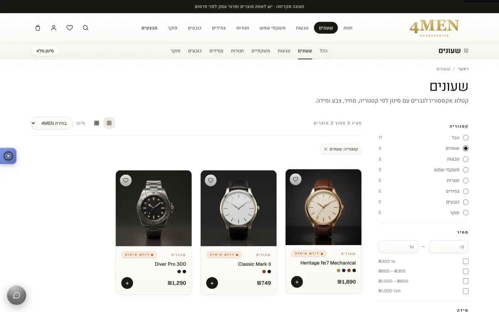

# 4MEN

> **A Hebrew, right-to-left men's accessories storefront — shipped as static files, managed by its owner, with no backend behind it.**

**Live:** [gentleman4u.vercel.app](https://gentleman4u.vercel.app)

  

4MEN sells watches, rings, sunglasses, belts, bracelets, hats and poker sets in Israel. 17 HTML pages, 17 products across 7 categories, `HTML` + `CSS` + `JavaScript` — no framework, no build step — on `Vercel`, with `GSAP` motion over a Liquid Glass design system. The source repo is private; this page describes how it works.

## Running a storefront, a checkout and an admin panel with no server

Every dynamic surface is client-side: catalog, search, cart, checkout, wishlist, account and a WooCommerce-style admin panel. Filter and sort state lives in the URL, so any view is shareable, with `?q=` results noindexed and the canonical kept category-only. The store runs in one of two explicit modes: **preview**, where checkout saves an order draft in the browser and nothing is sent, or **WhatsApp**, where checkout prepares a complete order request that the customer still has to send. Login is a local profile, not authentication, and the site never claims a payment happened. Payments, real auth and transactional email are backend-phase work; the contact form is a real WhatsApp deep link, not a fake "message sent".

## Managing catalog, coupons and settings through one editable overlay

The admin panel edits an in-memory copy of `PRODUCTS` / `CATEGORIES` / `COUPONS` / `SETTINGS` and persists it to `localStorage.g4u_admin`; `data.js` applies that overlay *before* `shop.js` parses, so cart pruning and search see the managed catalog, not the shipped one. "Export data.js" bakes it into a committable file — also the seed for the drafted 17-table Supabase schema.

Operational constants live in one place: shipping fees, free-shipping threshold, dispatch cutoff and a typed coupon catalog (percent / flat / free-shipping, each with minimum subtotal, expiry and an active flag). Coupon copy is generated from the rule itself, so no message drifts from what the rule does. Each product carries a supplier-verification flag that material edits clear again; only verified products emit `Product` structured data or sitemap entries, and a launch-readiness dashboard in the admin lists the blockers — placeholder contacts, unverified products, images that fail to load — before the store may leave preview mode. The admin panel is a client-side operator surface, documented in-repo as convenience rather than an access control.

## Closing the order loop through a shared localStorage contract

Checkout writes `g4u_orders` under a documented shape (`num/ts/status/items/totals/coupon/shipMethod/contactMethod/customer/address`); `account.html` renders it as real order history and `admin.html` manages its statuses. That contract replaced hardcoded fake orders and made the admin Orders module real.

## Blocking scrapers and public CORS proxies at the edge

`middleware.js` runs on the Vercel Edge Runtime across 18 routes, returning a branded 403 for empty User-Agents, known scraper agents, and `Origin`/`Referer` values from public CORS proxies. Headless-browser signatures were deliberately *removed*: they 403'd first-party QA tooling for little gain — a serious scraper spoofs a normal UA anyway.

`vercel.json` sets CSP with no `unsafe-eval` and `frame-ancestors 'none'`, two-year HSTS with preload, `COOP`/`CORP` same-origin, and a `Permissions-Policy` denying camera, geolocation and payment. With no content-hashed filenames, caching is split by hand: HTML `no-store`, JS/CSS `no-cache, must-revalidate`, images `immutable` for a year.

## Deleting the claims that were not true

The fabricated site-wide scale numbers (12,400 customers / 3,847 reviews / 522 models), the self-serving `Organization` review JSON-LD and the invented category counts were deleted from every HTML page — counts now derive from the catalog, and demo ratings and review items are stripped from the catalog on load until a server-verified review pipeline exists. Legal pages ship because an Israeli store legally requires them: terms of sale with the statutory 14-day cancellation right, privacy, and an accessibility statement against IS 5568 / WCAG 2.1 AA.

## Screenshots

| Catalog with URL-backed filters | Product page with colour and size variants |
|---|---|
|  |  |

  

## How it was verified

- **Playwright smoke on production** — 12 pages × 2 viewports: 0 P0, 4 P1, all fixed the same day.
- **Adversarial live regression fleet** — 7 verifiers + per-finding refutation judges, 151 checks: 0 P0/P1 and one confirmed P2 (a free-shipping coupon discounted a total that had no shipping line), fixed and re-verified.
- **End-to-end order run** — express shipping plus a coupon, arithmetic checked to the total, order confirmed in both account and admin.
- **Chromium + WebKit release gate** — a scripted buying flow at mobile width across all 16 public pages, covering malformed storage, order persistence, required variants, aggregate stock and the verified-only schema rule.

Source is private. Built by [@shear559](https://github.com/shear559).
